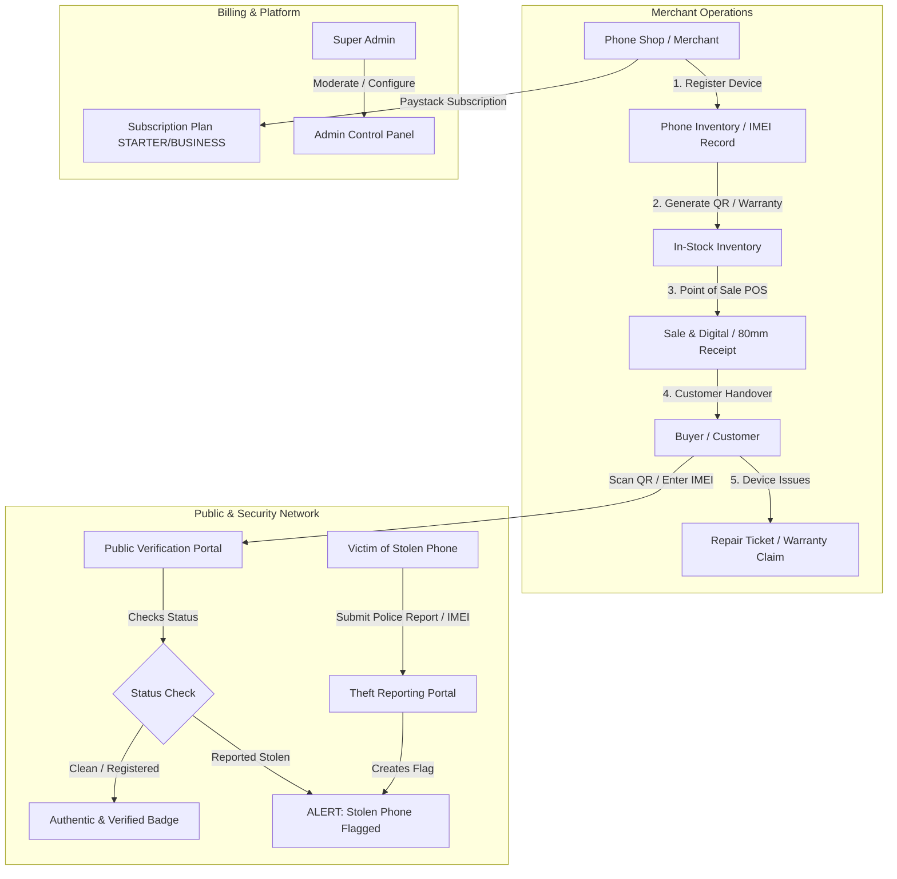

# 🛡️ NOXGUARDA — Institutional Phone Retail OS & Anti-Theft Registry

> **NOXGUARDA** is an enterprise-grade device lifecycle, inventory management, anti-theft verification, and Point of Sale (POS) SaaS platform tailored for mobile phone retailers, repair technicians, and consumers.

---

## 📑 Table of Contents
1. [Executive Summary](#-executive-summary)
2. [How the System Works](#-how-the-system-works)
3. [Core Feature Breakdown](#-core-feature-breakdown)
4. [User Roles & Access Control (RBAC)](#-user-roles--access-control-rbac)
5. [System Architecture & Tech Stack](#-system-architecture--tech-stack)
6. [Data Model & Entity Relationships](#-data-model--entity-relationships)
7. [External Integrations](#-external-integrations)
8. [Directory Structure](#-directory-structure)

---

## 🎯 Executive Summary

### The Problem
The secondary mobile phone market (used, refurbished, and newly imported devices) faces high fraud rates, lack of provenance tracking, stolen phone trade, and disjointed repair/warranty records. Traditional phone shops rely on physical paper receipts and manual logs, leading to lost records, warranty disputes, and inability to verify if a device is legitimate or blacklisted.

### The Solution: NOXGUARDA
NOXGUARDA provides an all-in-one ecosystem for:
- **Phone Retailers & Repair Shops**: Manage inventory, record IMEI/Serial numbers, issue digital and 80mm thermal receipts, manage repair tickets, track warranties, and analyze sales.
- **Consumers & Buyers**: Instantly verify device authenticity, carrier lock, activation status, warranty validity, and theft status via QR codes or public IMEI lookups.
- **Victims & Law Enforcement**: Report lost/stolen phones with IMEI blacklisting, police case numbers, and optional recovery bounties.
- **Platform Administrators**: Centrally oversee registered businesses, track transactions, moderate stolen device reports, and manage subscription plans.

---

## 🔄 How the System Works



### 1. Device Lifecycle & Provenance Flow
1. **Intake & Registration**:
   - The shop adds a device with its `IMEI 1`, `IMEI 2`, `Serial Number`, `Brand`, `Model`, `Storage`, `Color`, `Condition` (`NEW`, `REFURBISHED`, `LIKE_NEW`, etc.), and `Purchase Price`.
   - The system queries TAC parsers or cached device data to auto-fill hardware specs, carrier lock (`UNLOCKED`, `CARRIER_LOCKED`), and activation status.
   - Unique QR code is generated for the device.

2. **Sales & Point of Sale (POS)**:
   - When sold, a `Sale` and `SaleItem` record is created.
   - The device status transitions: `IN_STOCK` → `SOLD`.
   - Warranty start and expiry dates are automatically computed based on duration.
   - Formatted invoices and 80mm POS thermal receipts with QR codes are generated.

3. **Public Verification**:
   - Anyone (buyer, law enforcement, or downstream reseller) scans the QR code or enters the IMEI on the public portal.
   - The portal reveals whether the device belongs to a verified business, warranty status, specifications, and if any theft claims exist.
   - Every lookup records an audit entry in `VerificationLog` (capturing IP, timestamp, and status).

4. **Repair & Maintenance Management**:
   - Customers bring devices for repair → A `RepairTicket` is opened.
   - Track status: `DIAGNOSING` → `WAITING_PARTS` → `IN_PROGRESS` → `READY_FOR_PICKUP` → `COMPLETED`.
   - Technician notes, diagnostic logs, estimated vs final costs, and warranty validations are tied directly to the customer and device history.

5. **Anti-Theft Blacklisting & Bounty Flow**:
   - Users who lost their phone report it with proof (Google account screenshot, purchase receipt, police case number).
   - Once flagged in `TheftReport`, any verification check immediately triggers a red banner warning that the phone is stolen, displaying owner contact info or recovery bounty instructions.

---

## ⚡ Core Feature Breakdown

### 1. Public Verification Portal (`/`)
* **Instant IMEI / Serial Check**: Real-time validation against the database and TAC cache.
* **Verification Badge**: Shows authentic certification, merchant provenance, warranty expiration, and carrier status.
* **Stolen Device Alert**: Real-time warning if an IMEI has an active theft report.

### 2. Merchant Dashboard (`/dashboard`)
* **Overview & Analytics**: Total inventory value, monthly revenue, total sales, active repair count, and device breakdown.
* **Device Inventory Management (`/dashboard/inventory`, `/dashboard/register`)**:
  * Bulk & single device registration with IMEI deduplication.
  * Filter by brand, condition, stock status (`IN_STOCK`, `SOLD`, `IN_REPAIR`, `RESERVED`).
  * Instant QR code badge printing.
* **Point of Sale (POS) & Receipts (`/dashboard/sales`, `/dashboard/receipts`)**:
  * Fast checkout system with cash, card, bank transfer, POS, and split payments.
  * Automated 80mm thermal receipt generator and standard A4 PDF invoices.
  * Custom store headers, receipt footers, and warranty terms.
* **Repairs Management (`/dashboard/repairs`)**:
  * Track repair tickets with dynamic status badges.
  * Cost estimation, technician assignment, and customer communication.
* **Customer Directory (`/dashboard/customers`)**:
  * Complete customer purchase history, linked devices, and active repair tickets.
* **Business Settings & Branding (`/dashboard/settings`)**:
  * Store profile, logo upload, custom verification success messages, receipt printer formats (58mm/80mm), and bank details.

### 3. Stolen Device Registry (`/report-stolen`)
* **Public Theft Reporting**: Anyone can file a theft report for their device.
* **Verification & Proof Upload**: Attach proof of ownership, police report number, and contact details.
* **Bounty System**: Set a reward amount for anyone who finds or recovers the device.
* **Dispute & Resolution**: Ability to resolve or clear a theft flag once recovered.

### 4. Subscription & Billing System (`/pricing`, `/dashboard/checkout`)
* **Tiered Subscription Plans**:
  * `FREE` / `STARTER` / `BUSINESS` / `ENTERPRISE`.
  * Tier limits: max registered devices, custom branding, priority support, multi-staff access.
* **Paystack Payment Gateway**:
  * Seamless NGN checkout, card payments, bank transfers, and automatic subscription renewals.
  * Real-time payment verification and transaction logging (`SubscriptionPayment`).

### 5. Super Admin Panel (`/admin`)
* **Business Directory (`/admin/businesses`)**: View all registered shops, suspend/activate accounts, and monitor device counts.
* **Subscription Management (`/admin/subscriptions`)**: Manage plan pricing, active subscribers, and revenue metrics.
* **Platform Settings (`/admin/settings`)**: Configure global feature toggles, API keys, and maintenance modes.
* **Support Ticket Center (`/admin/support`)**: Helpdesk for resolving merchant inquiries and IMEI ownership disputes.
* **Audit & Notifications (`/admin/notifications`)**: Global security alerts, new signups, and high-priority system events.

---

## 👥 User Roles & Access Control (RBAC)

| Role | Scope & Permissions | Typical User |
| :--- | :--- | :--- |
| **`ADMIN`** | Full platform access: manage businesses, modify plans, inspect system logs, moderate theft reports, global settings. | Platform Owner / Ops Team |
| **`BUSINESS`** | Tenant-scoped access: manage own store inventory, sales, receipts, customers, repairs, and staff. Data is isolated by `businessId`. | Shop Owner, Store Manager |
| **Public / Guest** | Read-only access to verify IMEIs, view public business verification pages, and report lost/stolen devices. | End Buyers, Consumers, Police |

---

## 🏗️ System Architecture & Tech Stack

```
NOXGUARDA (Monorepo via Turborepo)
├── apps/
│   ├── backend/   (NestJS + TypeScript + Prisma ORM + PostgreSQL)
│   └── frontend/  (Next.js 14 App Router + React + Tailwind CSS + Lucide)
└── packages/      (Shared configurations and types)
```

### Backend (`apps/backend`)
* **Framework**: Nest.js (Modular architecture, dependency injection).
* **Database & ORM**: PostgreSQL with Prisma ORM.
* **Authentication**: JWT (Access Tokens + Refresh Token rotation) with `bcrypt` password hashing.
* **Mailing**: Nodemailer for automated transactional emails and notifications.
* **Payments**: Paystack API integration for automated recurring billing and webhooks.

### Frontend (`apps/frontend`)
* **Framework**: Next.js (App Router, Server & Client Components).
* **Styling**: Tailwind CSS with custom design system and dark mode support.
* **Icons & UI**: Lucide React, Radix UI primitives, Canvas QR code generation, HTML5 Thermal receipt printing.
* **State & Fetching**: React Hooks, Context API, Axios / Fetch client with automatic token refresh.

---

## 🗄️ Data Model & Entity Relationships

| Model | Description | Key Relations |
| :--- | :--- | :--- |
| **`Business`** | The tenant shop profile, branding, and billing status. | Has many `Users`, `PhoneRecords`, `Sales`, `Repairs`, `Customers`. |
| **`User`** | Authenticated accounts (`ADMIN` or `BUSINESS`). | Belongs to `Business`, has many `RefreshTokens`. |
| **`PhoneRecord`** | Core device entity storing IMEIs, specs, pricing, and warranty. | Belongs to `Business`, optionally linked to `Customer`, `SaleItem`, `RepairTicket`. |
| **`Sale` & `SaleItem`** | Point of sale transaction record with invoice/receipt numbers. | Belongs to `Business`, linked to `Customer` and `PhoneRecord`. |
| **`RepairTicket`** | Tracks diagnostic and repair job orders for devices. | Belongs to `Business`, linked to `Customer` and `PhoneRecord`. |
| **`Customer`** | Directory of clients who buy or repair devices. | Belongs to `Business`, linked to `PhoneRecords`, `Sales`, `Repairs`. |
| **`TheftReport`** | Global registry of stolen devices with proof and bounty. | Indexed by `imei1`, `imei2`, `serialNumber`. |
| **`VerificationLog`**| Audit trail of every public lookup attempt. | Linked to `Business` (if verified) with status and IP. |
| **`SubscriptionPlan`** & **`SubscriptionPayment`** | SaaS subscription tiers and Paystack transactions. | Linked to `Business`. |

---

## 🔌 External Integrations

1. **Paystack Gateway**:
   - Card, Bank Transfer, USSD checkout.
   - Subscription lifecycle management and webhook event handling.
2. **IMEI & TAC Database**:
   - Automatic hardware model and manufacturer detection based on TAC (Type Allocation Code).
   - In-memory/database caching (`DeviceCheckCache`) to minimize latency and third-party API costs.
3. **QR Code Engine**:
   - Dynamically generated QR codes for every device linking directly to public verification URLs.
4. **Thermal Printer (ESC/POS & Web Print)**:
   - Direct-to-print 80mm and 58mm POS receipt layout for physical retail stores.

---

## 📂 Directory Structure

```
SOS/
├── apps/
│   ├── backend/
│   │   ├── prisma/
│   │   │   └── schema.prisma         # Database schema & migrations
│   │   └── src/
│   │       ├── admin/                # Admin control center endpoints
│   │       ├── auth/                 # Authentication, JWT, Guard & Strategies
│   │       ├── business/             # Business profile & store settings
│   │       ├── customers/            # Customer CRM
│   │       ├── dashboard/            # Aggregated analytics
│   │       ├── mail/                 # Transactional emails
│   │       ├── payments/             # Paystack billing & webhooks
│   │       ├── phones/               # Device inventory & IMEI management
│   │       ├── plans/                # SaaS plans & feature gates
│   │       ├── repairs/              # Repair ticket lifecycle
│   │       ├── sales/                # POS, checkout & sales records
│   │       ├── theft-reports/        # Stolen phone registry & bounty
│   │       └── verification/         # Public IMEI verification API
│   │
│   └── frontend/
│       └── src/
│           ├── app/
│           │   ├── (admin)/admin/    # Super admin management interface
│           │   ├── (dashboard)/      # Merchant dashboard (inventory, POS, repairs)
│           │   ├── report-stolen/    # Public theft reporting portal
│           │   ├── pricing/          # Subscription pricing tiers
│           │   └── page.tsx          # Public IMEI verification landing page
│           ├── components/           # Reusable UI component library
│           ├── hooks/                # Custom React hooks (auth, printing, etc.)
│           └── lib/                  # Utilities, API client, formatters
│
├── docker-compose.yml                # Local PostgreSQL database setup
├── package.json                      # Monorepo scripts & dependencies
└── turbo.json                        # Turborepo build pipeline configuration
```
